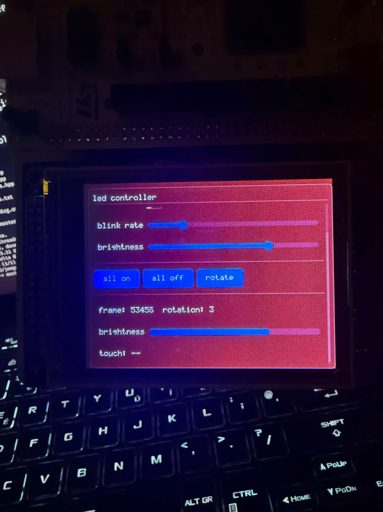

# jemgui

immediate mode gui for embedded displays. header-only, c++23, zero heap.

designed for resistive touchscreens on mcus like stm32f7. works with any display driver that can blit a framebuffer.

## usage

```cmake
FetchContent_Declare(jemgui
  GIT_REPOSITORY https://github.com/ImArjunJ/jemgui.git
  GIT_TAG main
)
FetchContent_MakeAvailable(jemgui)

target_link_libraries(your_target PRIVATE jemgui)
```

```cpp
#include <jemgui/jemgui.hpp>

JEMGUI_FRAMEBUF(framebuf, 320, 240);

jemgui::canvas<your_display_type> fb(display, framebuf);
jemgui::ctx ui(fb);

while (true) {
  jemgui::input_state input;
  // read your touch driver here (jstm example in folder)

  ui.begin_frame(input);

  ui.panel_begin("my panel");
  if (ui.button("click me")) { /* do stuff */ }
  ui.toggle("enable", some_bool);
  ui.slider("value", some_i16, 0, 100);
  ui.panel_end();

  ui.end_frame();
  fb.flush();
}
```

# showcase



## what you get

- buttons, toggles, sliders, progress bars, labels, separators
- panels with automatic vertical scrolling when content overflows
- rows and columns for horizontal/vertical layout
- auto-scaling across display sizes and rotations (fixed-point 8.8)
- dark and light themes
- touch input with proper press/release/drag handling
- clip rects so scrolled content doesn't bleed

## painter concept

the `canvas<D>` class handles buffered rendering with a built-in 5x8 font. it needs a display type `D` with:

```cpp
void blit(u16 x, u16 y, u16 w, u16 h, const u16* data);
u16 width();
u16 height();
```

or you can skip the canvas entirely and implement the full `painter` concept yourself — see `painter.hpp`.

## notes

- `JEMGUI_FRAMEBUF` places the buffer in `.sram1_bss` on arm targets so it doesn't eat your stack
- reference resolution is 320x240, everything scales from there
- works well with [jstm](https://github.com/ImArjunJ/jstm) and [jpico](https://github.com/ImArjunJ/jpico)
